# KnowMe Project Setup

`knowme-project-setup` is an [AgentSkills.io](https://agentskills.io/specification) skill that turns any directory into a KnowMe-structured project, or brings an existing repository up to date. It works for code, business processes, skill development, and research or documentation.

It orchestrates skills that already exist: `kbd-init`, `prometheus-context-bootstrap`, `agent-team-creator` and `build-branded-docusaurus`. It runs them in the right order with the right inputs, and applies the fixes recorded in [Lessons](./reference/lessons.md).

## What every project ends up with

| Piece | Where | Why |
|---|---|---|
| One instruction file for every agent | `AGENTS.md` (`CLAUDE.md` links to it) | Every harness reads the same invariants, commands and workflow |
| Spec-driven change workflow | `openspec/` plus skills and commands per harness | Any agent proposes, applies, verifies and archives changes the same way |
| Orchestration state | `.kbd-orchestrator/` (tracked) | Phase, change and task lifecycle that survives tool switches |
| Knowledge log and identity | `.prometheus/` (tracked) | Decisions, gotchas, postmortems, session log, model fleet, project ID |
| Agent team | `.agent-team/` plus native agents per harness | Named roles with disjoint ownership and bound skills |
| Product and design authority | `PRODUCT.md`, `DESIGN.md`, local UI skills | Evidence-based intent and tokens for every rendered surface |
| Docs site | `website/` plus a Pages workflow | Branded docs built from the same sources the agents read |

## The stages

```mermaid
flowchart LR
  D[0 Detect<br/>type · stacks · inventory] --> G[1 Git]
  G --> O[2 OpenSpec<br/>whole fleet]
  O --> C[3 Project context]
  C --> K[4 KBD<br/>init · migrate · identity]
  K --> T[5 Tracking<br/>.gitignore block]
  T --> P[6 Prometheus context<br/>AGENTS.md + symlink]
  P --> A[7 Agent team<br/>install per harness]
  A --> U{UI in scope?}
  U -- yes --> UI[8 UI and design tools]
  U -- no --> S
  UI --> S[9 Docs site]
  S --> H[10 GitHub<br/>Pages · About link]
  H --> M[11 Commit and push<br/>privacy scan first]
```



Each stage checks first, changes only what's missing or outdated, and reports `CREATE`, `UPDATE`, `SKIP` or `BLOCKED`. Greenfield projects run every stage from scratch. Brownfield projects converge on the same structure without overwriting what an operator wrote. See [Brownfield conversion](./reference/brownfield.md).

## Install

```bash
npx skills add Know-Me-Tools/know-me-project-management --skill knowme-project-setup
# or, in Claude Code:
claude plugin marketplace add Know-Me-Tools/know-me-project-management
```

Then, in the target project, ask your agent to "set up this project with knowme-project-setup".

## Read next

1. [Every step, explained](./guide.md): the original run, step by step, with the purpose of each step and its parameters.
2. [Skill contract](./skill-contract.md): the `SKILL.md` agents follow.
3. [Stage contracts](./reference/stages.md): the commands, checks and edge cases for each stage.
4. [Project types](./reference/project-types.md) and [team archetypes](./reference/team-archetypes.md): what changes for each kind of project.
